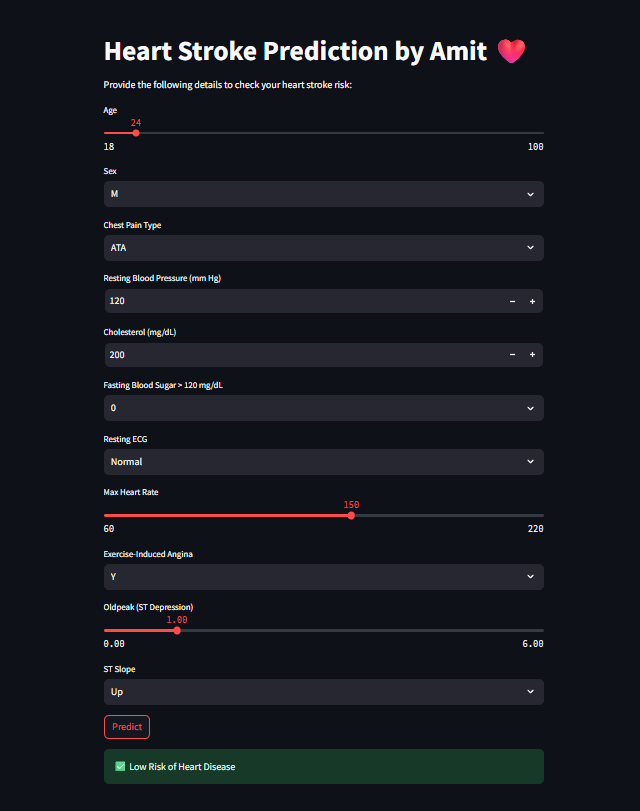

# ❤️ Heart Disease Prediction App

> A machine learning web application that predicts the risk of heart disease based on patient health parameters — built with **Streamlit** and powered by **Logistic Regression**.



---

## 📌 Project Overview

Heart disease is one of the leading causes of death worldwide. Early detection can save lives. This app allows users to input their health data and instantly get a prediction on whether they are at **High Risk** or **Low Risk** of heart disease — all through a clean, interactive web interface.

The model is trained on the [Heart Failure Prediction Dataset](https://www.kaggle.com/datasets/fedesoriano/heart-failure-prediction) from Kaggle, using **Logistic Regression** with feature scaling and one-hot encoding.

---

## ✨ Features

- 🎛️ Interactive sliders and dropdowns for 11 health parameters
- ⚡ Instant prediction with a single click
- ✅ Clear result display — **High Risk** or **Low Risk**
- 🧠 Trained ML model with preprocessing pipeline (scaler + column alignment)
- 🌙 Clean dark-themed UI via Streamlit

---

## 🛠️ Technologies Used

| Technology | Purpose |
|---|---|
| 🐍 Python | Core programming language |
| 📊 Pandas | Data manipulation and input handling |
| 🤖 Scikit-learn | Logistic Regression model + StandardScaler |
| 💾 Joblib | Model serialization and loading |
| 🌐 Streamlit | Interactive web app UI |
| 📓 Jupyter Notebook | EDA and model training |

---

## 🏗️ Project Architecture

```
Heart_Disease_App/
│
├── app.py                   # 🌐 Streamlit web application (main entry point)
├── heart.csv                # 📂 Dataset used for training (918 records)
├── heart.ipynb              # 📓 Jupyter notebook — EDA + model training
│
├── LG_heart_model.pkl       # 🤖 Trained Logistic Regression model
├── LR_scaler.pkl            # ⚖️ Fitted StandardScaler for input normalization
├── LG_columns.pkl           # 📋 Expected input columns after one-hot encoding
│
└── README.md                # 📄 Project documentation
```

**Flow:**
```
User Input → One-Hot Encoding → Column Alignment → StandardScaler → Logistic Regression → Prediction
```

---

## ✅ Prerequisites

Make sure you have the following installed:

- Python 3.8+
- pip

Install all dependencies with:

```bash
pip install -r requirements.txt
```

**`requirements.txt` includes:**
```
streamlit
pandas
scikit-learn
joblib
```

---

## 💡 Importance of This Project

- 🏥 **Healthcare Impact** — Helps individuals get an early indication of heart disease risk without needing a doctor visit
- 📈 **Data-Driven** — Uses real clinical data with 11 medically relevant features
- 🔬 **Reproducible ML Pipeline** — Full pipeline from EDA to deployment in one repo
- 🚀 **Beginner Friendly** — Great example of an end-to-end ML project with a deployable web app
- 🌍 **Accessible** — Anyone can run it locally with just a few commands

---

## 🚀 How to Run Locally

**1. Clone the repository:**
```bash
git clone https://github.com/Amit4141/ML_Projects.git
cd ML_Projects/Heart_Disease_App
```

**2. Install dependencies:**
```bash
pip install -r requirements.txt
```

**3. Run the Streamlit app:**
```bash
streamlit run app.py
```

**4. Open your browser** and go to `http://localhost:8501`

---

## 🧾 Input Features

| Feature | Description | Type |
|---|---|---|
| 🎂 Age | Patient's age in years | Slider (18–100) |
| 🚻 Sex | Biological sex | M / F |
| 💔 Chest Pain Type | Type of chest pain experienced | ATA / NAP / TA / ASY |
| 🩺 Resting BP | Resting blood pressure (mm Hg) | Number (80–200) |
| 🧪 Cholesterol | Serum cholesterol (mg/dL) | Number (100–600) |
| 🍬 Fasting Blood Sugar | Fasting BS > 120 mg/dL | 0 (No) / 1 (Yes) |
| 📉 Resting ECG | Resting electrocardiogram result | Normal / ST / LVH |
| 💓 Max Heart Rate | Maximum heart rate achieved | Slider (60–220) |
| 🏃 Exercise Angina | Exercise-induced angina | Y / N |
| 📊 Oldpeak | ST depression induced by exercise | Slider (0.0–6.0) |
| 📈 ST Slope | Slope of peak exercise ST segment | Up / Flat / Down |

---

## ⚠️ Important Notes

- 🔬 This app is for **educational and informational purposes only** — it is **not a medical diagnosis tool**
- 👨‍⚕️ Always consult a qualified healthcare professional for medical advice
- 📊 The model achieves good accuracy on the test set but may not generalize to all populations
- 🗂️ The `.pkl` files (model, scaler, columns) must be present in the same directory as `app.py`
- 🐍 Ensure you are using **Python 3.8+** for compatibility

---

## 👨‍💻 Author

**Amit Mahajan**

- 🐙 GitHub: [@Amit4141](https://github.com/Amit4141)
- 📧 Email: [amitofficial4141@gmail.com](mailto:amitofficial4141@gmail.com)

---

> ⭐ If you found this project helpful, give it a star on GitHub!
